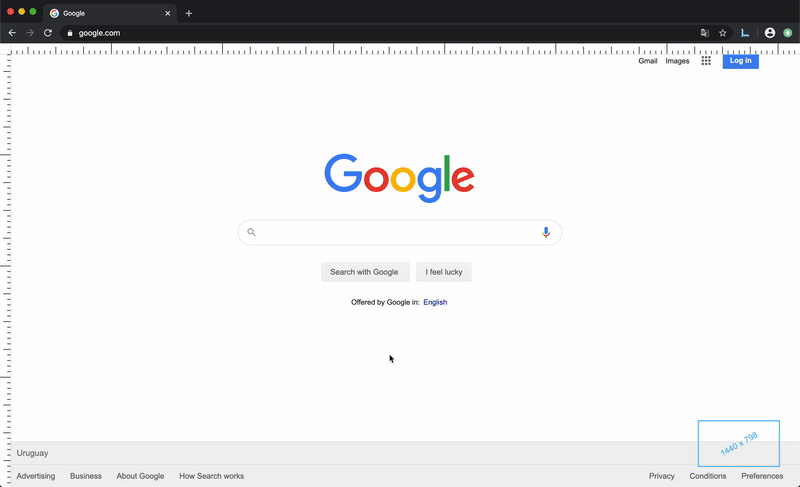

  

# Linetef

Linetef is a chrome extension and it's intention is to allow users to quickly add guide lines to either check if two elements are aligned, measure elements or check the distance between them.

## Demo

## Features

* Create guides in the screen in order to measure elements (both horizontal and vertical guides).
* See the distances between elements (or measures) in pixels or percentage mode.
* See the viewport size (width x height).
* Select the color of the created guides.
* Choose the position of the rulers (top/bottom and left/right of the screen).
* Show/hide the whole extension.
* Show/hide the distances between elements (useful if you just want to see if some elements are aligned).
* Show/hide the viewport size.

### Shortcuts

* Show/hide extension: `ctrl + shift + O`
* Show/hide distances: `ctrl + shift + D`
* Show/hide viewport: `ctrl + shift + V`
* Toggle between modes: `ctrl + shift + M`
* Delete guide: `Grab a guide + del`
* Delete all guides: `ctrl + del`
* Reset configs: `ctrl + R`
* Change horizontal ruler position: `ctrl + shift + T/B`
* Change vertical ruler position: `ctrl + shift + L/R`

## Roadmap

* Add ability to create rectangles, so users don't have to create 4 guide lines to measure an element.

## How to develop

1. Fork and clone the repository
2. Run `yarn start`
3. Run `yarn watch:dev`
4. Open chrome
5. Go to chrome extensions menu (chrome://extensions)
6. Toggle Developer mode
7. Click on Load Unpacked
8. Select the generate dist folder
9. Enjoy the hot reload 😁
